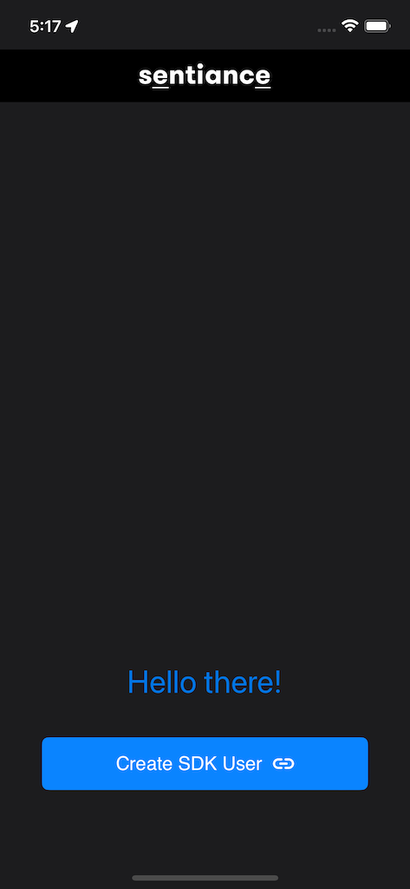
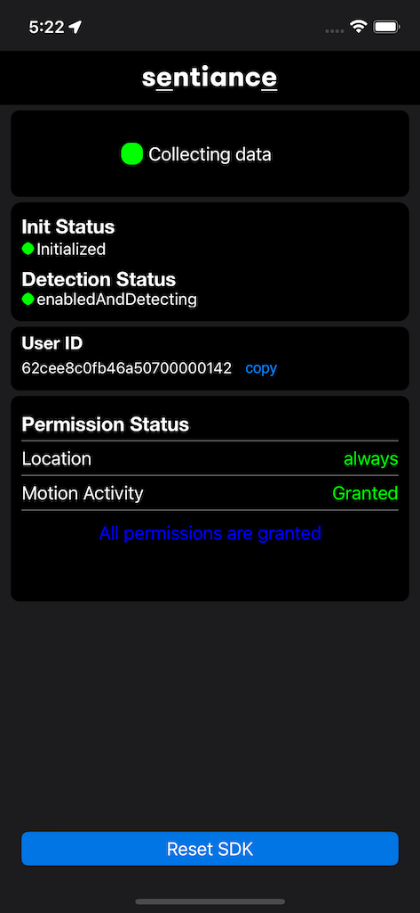

# Sample iOS Application

This is a sample application to demonstrate how to integrate the Sentiance iOS SDK.

## What's in this?

In this sample application we cover the SDK Integration (and SDK user creation) - with [user linking](https://docs.sentiance.com/important-topics/user-linking-2.0)

## Where to Start?

There are two places you need to look at

1. `initializeSentianceSDK` in the `AppDelegate.swift`
2. `createUserAndEnableDetections` in the `UserCreationViewController.swift`

## To run this project:

1. Request a developer account by [contacting Sentiance](mailto:support@sentiance.com).
2. Setup your backend to provide authentication code to Application. See: [**sample api server**](https://github.com/sentiance/sample-apps-api)
3. In `Podfile` update the Sentiance SDK dependency version to the latest one shown [here](https://docs.sentiance.com/sdk/changelog/ios).
4. Run `pod install` inside project directory.
5. Update the `BACKEND_BASE_URL` in `Helpers/AuthCodeAPI.swift` to get authentication code from your server.
6. Using Xcode open `sample_app_ios.xcworkspace` and run.

## More info

- [Full documentation on the Sentiance SDK](https://docs.sentiance.com/)
